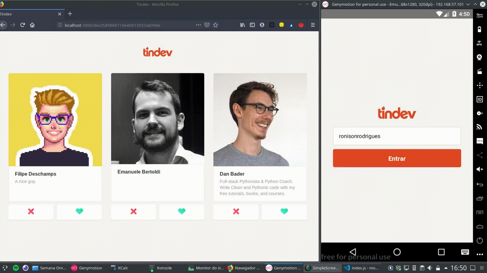
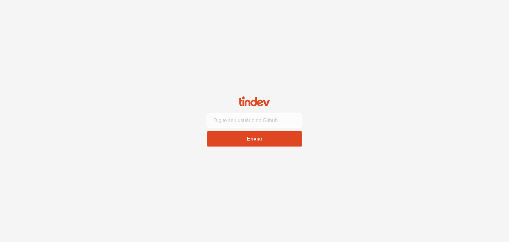
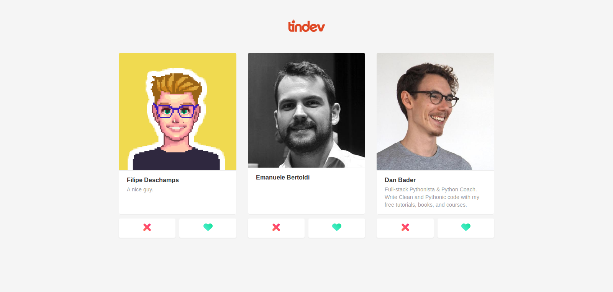
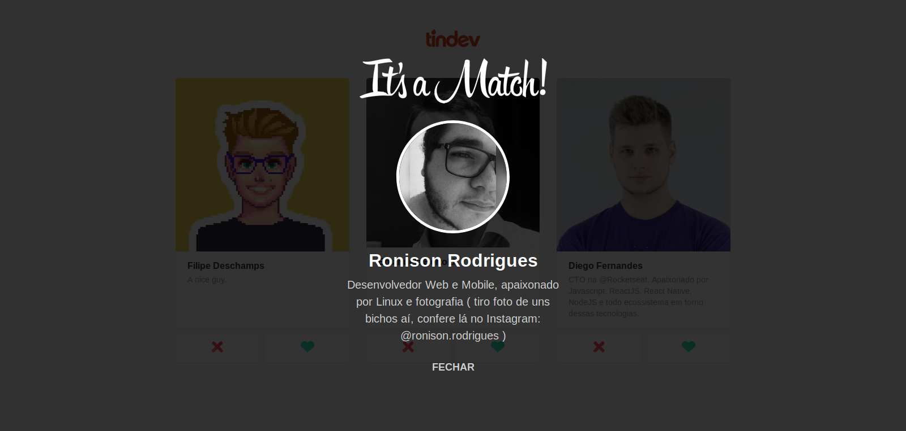

# Tindev
> Pequena copia do Tinder para programadores desenvolvida durante a Semana OminiStack 8 da @Rocketseat

Projeto desenvolvido em NodeJS, ReactJS, React Native e comunicação real time com Socket.io










## Inicialização

Backend:

```sh
yarn dev
```

Frontend:

```sh
yarn start
```

Mobile (Android):

Primeira execução para instalar o app:
```sh
yarn react-native run-android
```
Após a primeira instalação:
```sh
yarn start
```

Mobile (iOS):

Primeira execução para instalar o app:
```sh
yarn react-native run-ios
```
Após a primeira instalação:
```sh
yarn start
```
